# AuditaBook — Sistema de Gestión de Auditorios

Aplicación web para la reserva de auditorios universitarios y venta de entradas para eventos. Desarrollada con Laravel 12 + Vue 3 + Inertia.js + Tailwind CSS.

---

## Roles del sistema

| Rol | Descripción |
|-----|-------------|
| **user** | Usuario normal — puede ver eventos, comprar asientos individuales |
| **staff** | Organizador — puede alquilar auditorios completos y gestionar eventos |
| **admin** | Administrador — CRUD de espacios, gestión de usuarios y monitoreo de reservas |

---

## Funcionalidades por rol

### User
- Registro e inicio de sesión
- Explorar catálogo de eventos disponibles
- Ver detalle del evento con mapa de asientos interactivo
- Seleccionar asientos y proceder al checkout
- Ver ticket digital con asientos asignados
- Historial de mis reservas

> **Captura - Catálogo de eventos:**  
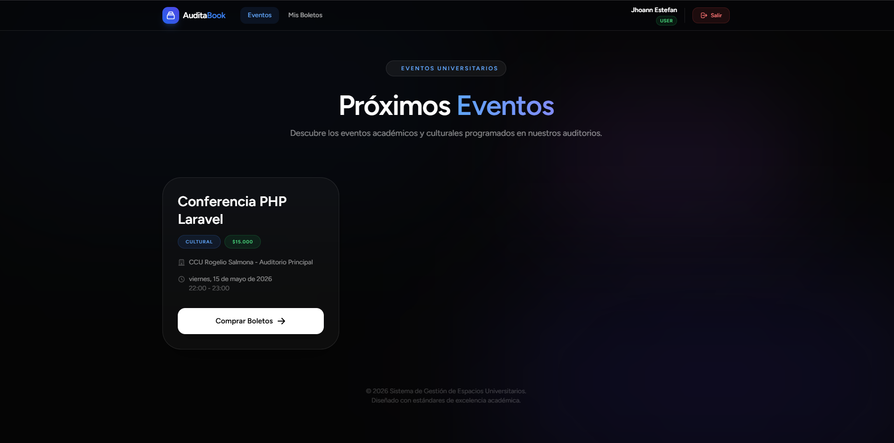
> **Captura - Mapa de asientos y selección:** 
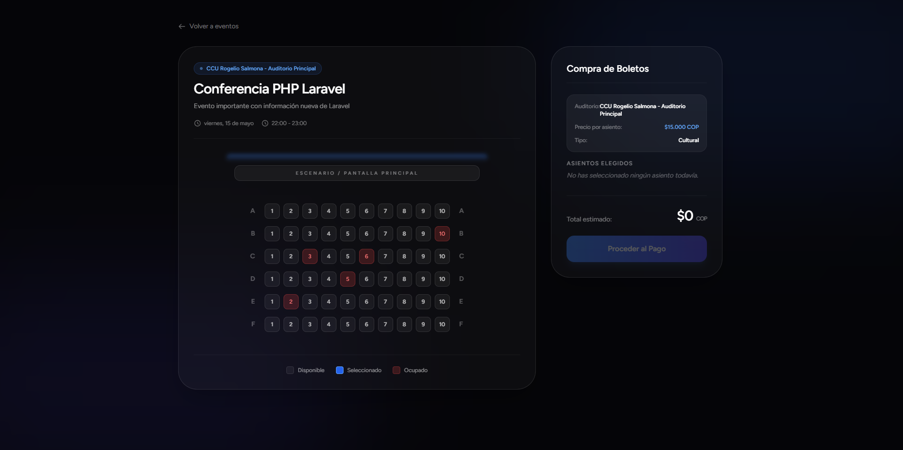
> **Captura - Ticket digital:** 
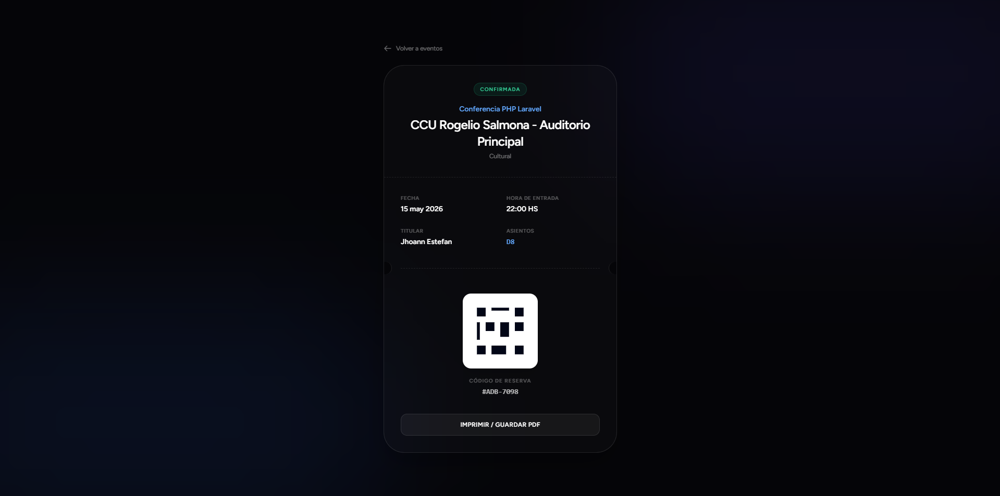

### Staff
- Alquilar un auditorio completo por horas
- Crear evento asociado al alquiler (nombre, descripción, precio de entrada)
- Gestionar asientos del evento desde un mapa interactivo
- Asignar asientos manualmente a invitados (click en el mapa)
- Liberar asientos ocupados
- Ver estadísticas: entradas vendidas, ingresos totales

> **Captura - Alquiler de auditorio:** 
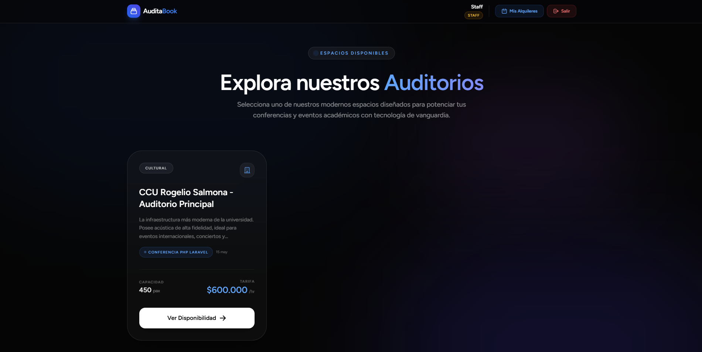 
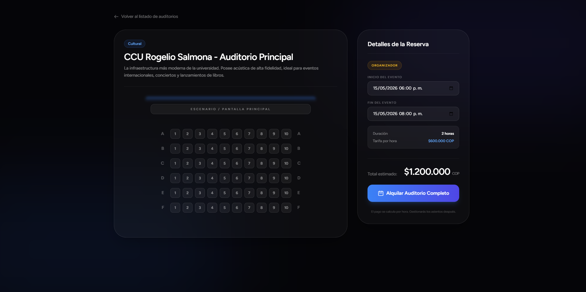
> **Captura - Gestión de evento con mapa de asientos:** 
 
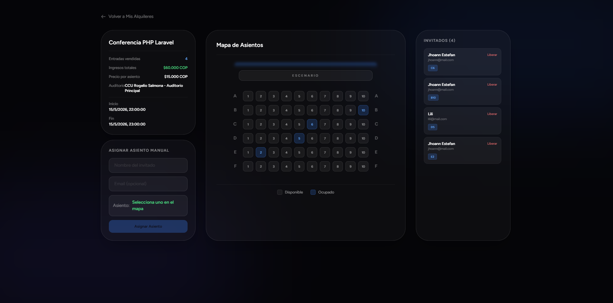
> **Captura - Asignación manual de asiento:**  
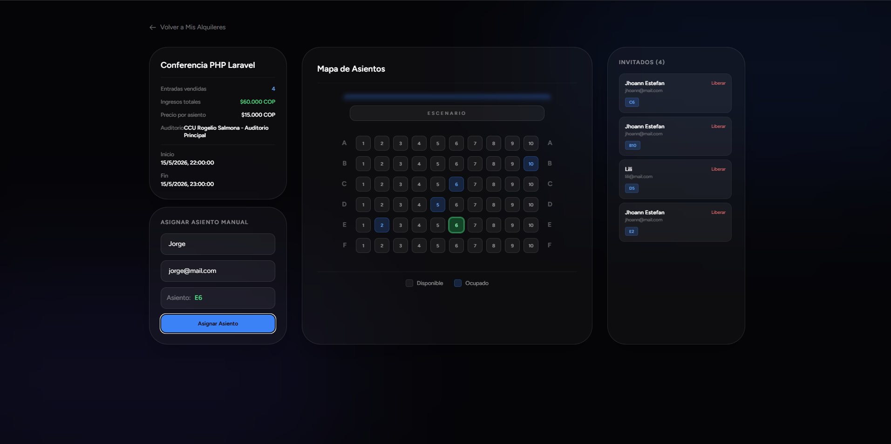
### Admin
- CRUD completo de auditorios/espacios
- Gestión de usuarios (cambio de rol, eliminación)
- Monitoreo de reservas separado por tipo:
  - Asientos individuales (comprados por usuarios)
  - Auditorios completos (alquilados por staff)

> **Captura - CRUD de espacios:** 
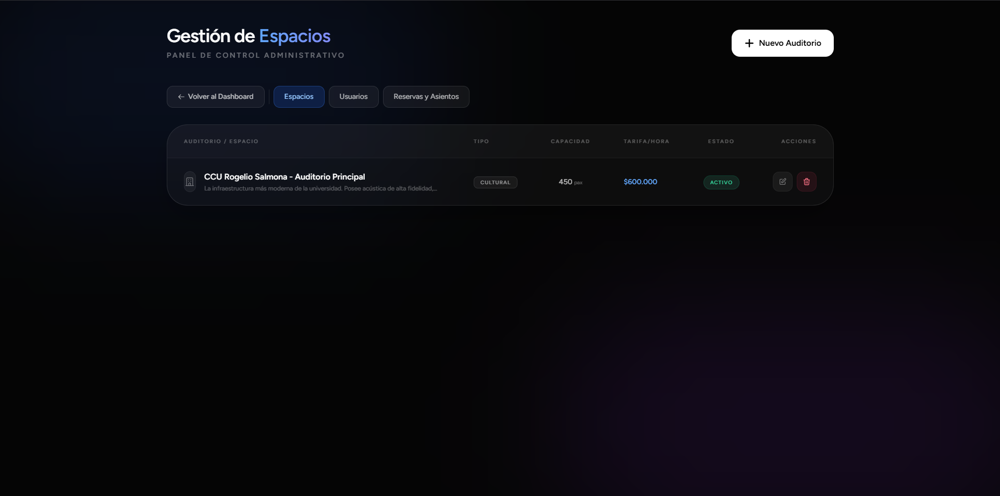
> **Captura - Gestión de usuarios:** 
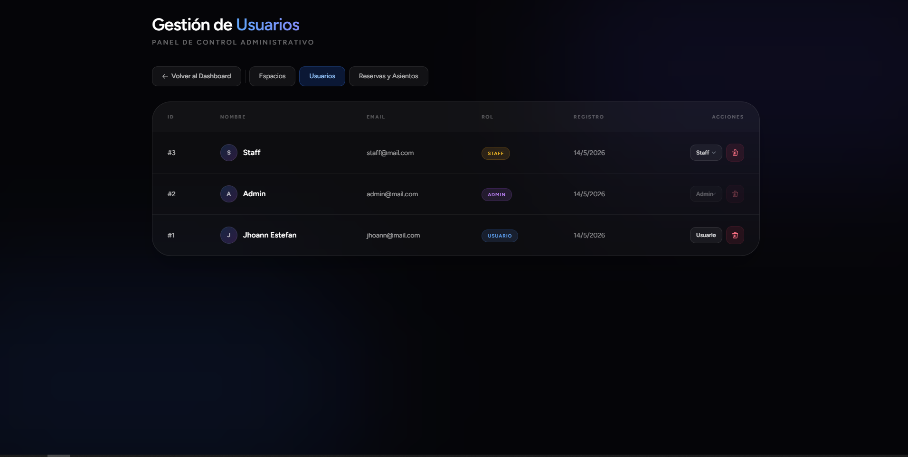
> **Captura - Monitoreo de reservas (tabs):**  
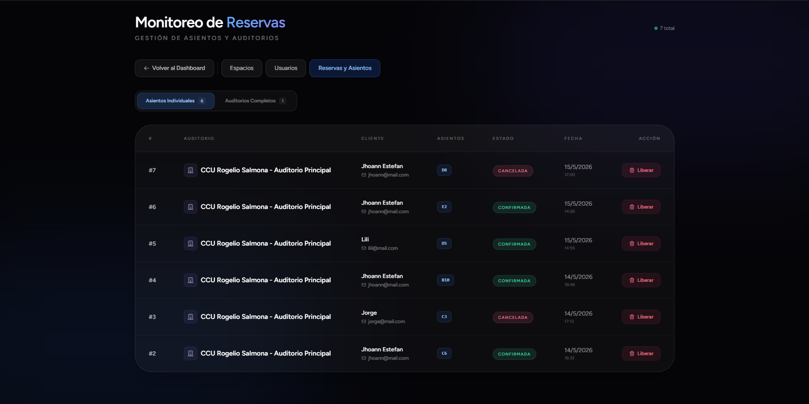 
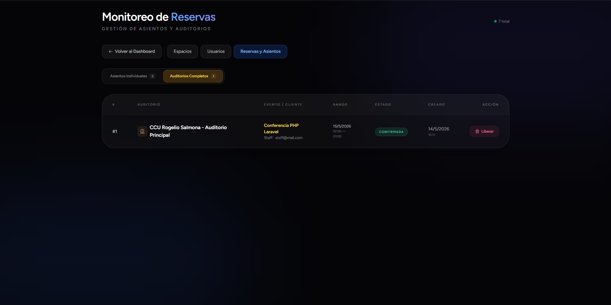

---

## Estructura de rutas principales

```
Público:
  GET  /eventos                    → Lista de eventos
  GET  /eventos/{slug}             → Detalle del evento + mapa de asientos
  GET  /auditorios                 → Catálogo de auditorios
  GET  /auditorios/{slug}          → Detalle del auditorio
  GET  /finalizar-reserva          → Checkout / pago
  GET  /mis-reservas               → Historial del usuario
  GET  /ticket/{reservation}       → Ticket digital

Staff:
  GET  /staff/checkout             → Checkout de alquiler
  POST /staff/rentals              → Crear alquiler + evento
  GET  /staff/rentals              → Mis alquileres
  GET  /staff/events/{id}/manage   → Gestionar evento (mapa de asientos)
  POST /staff/events/{id}/assign-seat  → Asignar asiento
  DELETE /staff/events/{id}/remove-seat → Liberar asiento

Admin:
  GET  /admin/spaces               → CRUD de espacios
  GET  /admin/users                → Gestión de usuarios
  GET  /admin/reservations         → Monitoreo de reservas
```

---

## Tecnologías

| Tecnología | Versión |
|------------|---------|
| Laravel | 12 |
| Vue | 3 |
| Inertia.js | v3 |
| Tailwind CSS | 4 |
| Jetstream | — |
| Sanctum | — |
| PHP | 8.4+ |
| MySQL | — |

---

## Instalación

```bash
git clone <repo-url>
cd AuditaBook
composer install
npm install
cp .env.example .env
php artisan key:generate
php artisan migrate
php artisan serve
npm run dev
```

---

## Base de datos

Tablas principales: `users`, `spaces`, `events`, `reservations`, `availabilities`, `blocked_slots`.

Los asientos se almacenan como JSON en `reservations.notes.asientos_reservados`. No hay tabla separada para asientos. El mapa es fijo: 6 filas (A-F) × 10 columnas por auditorio.
